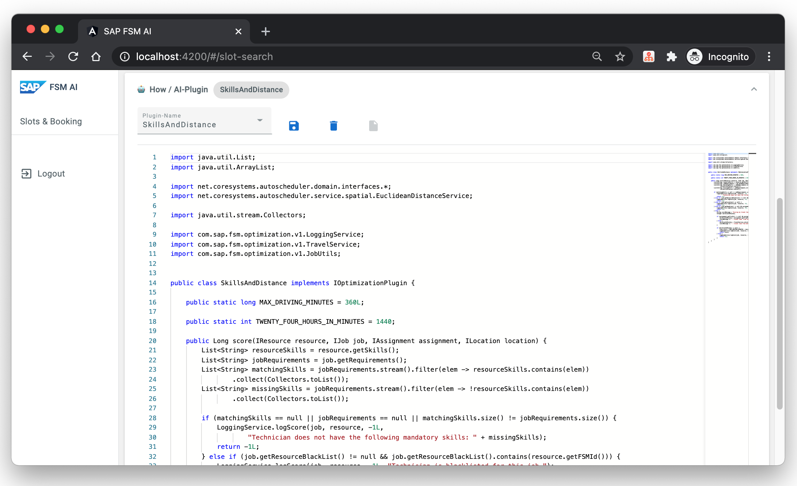

# How to / Quick Guide
The prerequisites are that you have the workbench application running.

# 1. Login
Login with your **FSM Account**.

# 2. Request options: Slots - When / Timeing
Setup the slots you want to match technicians for. You can modify timeing - **start and end** and **copy all on a given day** or **delete** a slot. You can also **bulk generate** more slots or clear all using the controls at the bottom. For the bulk generation for each day in the span the slots will be filled up from the start time of the first and the end time of the last day.

# 3. Request options: Job - Where / Job
In the job editor you can specify **required skills** , the **job duration** and the *location* where the job has to be performed. Note: that a location is mandatory and needs to be a valid geolocation (lat/log).

You may use the **pick from map** option to pick a location of your choice. For this click the **pick from map** button, then click on the map to set the geo marker.

A drop down with already defined address location of your FSM account can be found at the bottom of the form.

# 4. Request options: Technicians - Who / People

Here you can specify what technicians to consider for the slot-searching. For this you can use the query editor on the right and input fsm-query to search for the technicians by clicking **run query**.

# 5. Request options: Plugin-Editor - How / AI-Plugin
The workbench offers a lightweight plugin editor. Here you can view and edit the used plugin code to determine the matching score of a technician to a slot.

Either choose from the pre-installed plugins in the dropdown or create a new plugin using the file-new button.

Note: pre-installed default plugins will only be available to selected if no custom plugin is saved into the fsm-account.

# 6. Slot Search Request / Response
If all requet options are set click **Search Request** to search for slots.

The result plain will open automatically and will include one result line for every slot where at least one matching technician was found.

Clicking on the result line will expand the result where you can find more information for every matching technician, such as **estimated driving time and distance** the **estimated time of arrival** of the technician as well as score and name.

For more technical insides you can find information about **response time** and **response result** next to the request button.

Full **JSON Request Body** and full **JSON response Body** can be found by expanding the cards.

# 7. Slot Booking

The workbench has a **example implementation** of a booking implemented in nodeJS.

**Note:**  *That the booking implementation highly depends on you data backend implementation, for example purposes when booking all needed fsm objects (such as customer/**business-partner**, **service-call**, **activity**, **address**) are created.*

## 7.1 Booking with retry
As in a real world scenario it might be likely that once step 6. is performed - meaning you fetch and are able to see free slots, there is a possibility, that in the mean time a other customer or system books the same slot you want to book. FSM does **not automatically block or reserve any slot** when you search for them.

To account for this possible race condition you can do the following:

### 7.1.1 Install validation business-rule

Install the example [validation business-rule](./../business-rules/no-overlapping-assignments/customRules.json) into your FSM account. This rule will **no allow any overlapping bookings**. In coming request in FSM will be checked and blocked to ensure every technician only has one booking at the time.

to install the rule:

1. Open the FSM admin application by [login to FSM](https://apps.coresystems.net/) -> `Settings and Configuration` -> `Administration`
2. Open your active company `Companies` -> select you company
3. Navigate to `Business Rules` in the left menu and click the `Upload`-button on the right side and upload the [customRules.json](./../business-rules/no-overlapping-assignments/customRules.json) file in the `no-overlapping-assignments` folder from this repository.

## 7.1.2 Trigger Booking
If you click on **Book Slot for ...** the application will **try** to book the **first available** technician for the given slot.

implementing the booking process:
1. send booking request to fsm
2. business-rule (if installed and activated) will check
3. if the slot is already booked, we try to book the next available technician in the result set. (with a lower score)
4. if the slot is is free it will be booked and the process ends
5. if no free slot can be found the process ends

